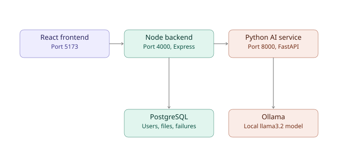

# ThoughtFlow Ops

An AI-powered pipeline that ingests QA test-failure spreadsheets (Excel/CSV),
uses a locally-run LLM (Ollama) to automatically categorize and summarize each
failure, and surfaces the results on a searchable, filterable operations
dashboard — with zero cloud API costs and zero data leaving your machine.

## Architecture



The system is three independent services:

- **React frontend** (Vite, port 5173) — login, upload, and dashboard UI
- **Node backend** (Express, port 4000) — auth, file parsing, database access, orchestrates AI analysis
- **Python AI service** (FastAPI, port 8000) — runs prompts against a local Ollama model

## Features

- JWT authentication with role-based access control (QA_LEAD / ADMIN / VIEWER)
- Drag-and-drop Excel/CSV upload with live progress tracking
- Automatic AI categorization of failures (category, severity, plain-English summary)
- Batched, incremental processing so large files don't overload memory
- Validation guards against empty/malformed rows and AI hallucination on blank input
- Searchable, filterable, sortable failure log
- Live dashboard with metric cards and charts (category/severity breakdowns)
- Zod schema validation on all write endpoints
- Indexed database queries for fast filtering at scale
- Automated test suite (unit + integration, 18+ tests)

## Prerequisites

- Node.js (v18+)
- Python 3.11+
- PostgreSQL (v16+)
- [Ollama](https://ollama.com), with the `llama3.2` model pulled: `ollama pull llama3.2`

## Setup

### 1. Database
```bash
psql -U postgres -c "CREATE DATABASE thoughtflow_ops;"
```

### 2. Backend
```bash
cd backend
npm install
# Create a .env file with DATABASE_URL, JWT_SECRET, PORT, AI_SERVICE_URL
npx prisma migrate dev
npm run dev
```

### 3. AI service
```bash
cd ai-service
python -m venv venv
.\venv\Scripts\Activate.ps1     # Windows
pip install -r requirements.txt # or: pip install fastapi uvicorn ollama
uvicorn main:app --reload --port 8000
```

### 4. Frontend
```bash
cd frontend
npm install
npm run dev
```

Visit `http://localhost:5173`.

## Running Tests

```bash
cd backend
npm test
```

## Project Structure